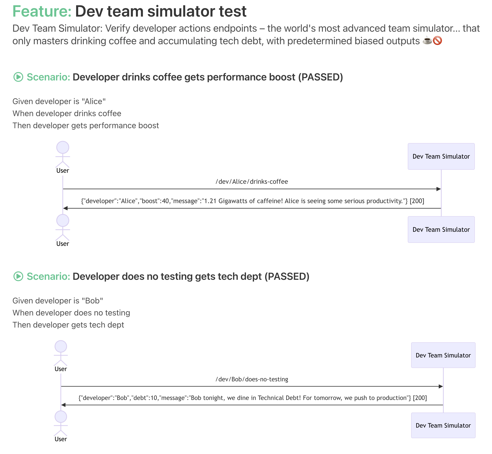

# Flow BDD


## Overview

**Turn your automated tests into living product documentation — without the BDD (behavior-driven development) overhead.**

## The Purpose of Functional Testing including BDD
Testing isn't just about catching bugs. When done correctly, automated tests serve critical functions:
1. **Verifying Behavior:** Ensuring the system does exactly what the business intended.
2. **Enabling Refactoring:** Providing the safety net needed to improve code without breaking functionality.
3. **Living Documentation:** Acting as the ultimate source of truth for how the system actually works.
4. **Increased agility:** See [Philosophy & Culture](#philosophy--culture) more:
   * **Waste Elimination**
   * **Iterating with Fast Validated Feedback** 
   * **Value Amplification**

## The Problem: Inefficiency and the "Cucumber Trap"
The conventional approach to BDD (like Cucumber or Gherkin) tries to solve this but often introduces **Waste** and is suboptimal at solving the above. By forcing you to maintain separate feature files and "glue code," it creates:
* **Complexity:** You spend more time managing the framework than testing the product.
* **Fragility:** Tests break because of text changes, not logic changes.
* **Documentation Rot:** Feature files quickly drift from the actual code behavior.

## The Solution: Flow BDD
Flow BDD is the most productive way to implement Behavior Driven Development by turning the process on its head. Instead of writing static feature files first, you write **clean, best-practice code first**.

Flow BDD then automatically generates:
* **Interactive Feature Files:** Documentation that is always in sync with your code.
* **UML Diagrams:** Visualizing downstream interactions and data flows (HTTP headers/bodies).
* **Living UI:** A generated dashboard with buttons to re-run tests and modify parameters on the fly.

**Focus on testing the behavior with best practices. Automate the documentation.**

### This is an example of the documentation generated from the following test below:


```java
@ExtendWith(FlowBdd.class)
public class DevTeamSimulatorTest extends BaseTest {

    @Override
    public void doc() {
        featureNotes("Dev Team Simulator: Verify developer actions endpoints – the world's most advanced team simulator... that only masters drinking coffee and accumulating tech debt, with predetermined biased outputs ☕🚫");
    }

    @Test
    void developerDrinksCoffee_getsPerformanceBoost() throws Exception {
        givenDeveloperIs("Alice");
        whenDeveloperDrinksCoffee();
        thenDeveloperGetsPerformanceBoost();
    }

    @Test
    void developerDoesNoTesting_getsTechDept() throws Exception {
        givenDeveloperIs("Bob");
        whenDeveloperDoesNoTesting();
        thenDeveloperGetsTechDept();
    }
}
```

## How does it work?
Flow BDD uses a process called **Wordify** to turn your clean Java code into human-readable documentation.

For example, a test method like `whenDeveloperDrinksCoffee()` is automatically tokenized to:  
`When developer drinks coffee`.

It gives you the freedom to write tests in the way you want, without the "Gherkin tax." There is a simple API to:
* **Add Notes:** Use `featureNotes()` to set the scene (e.g., explaining that your simulator only masters coffee and tech debt).
* **Capture Interactions:** Automatically generate **Sequence Diagrams** showing the flow between a `User` and the `DevTeamSimulator`.
* **Inspect Data:** Capture HTTP request/response headers and bodies (like the "1.21 Gigawatts of caffeine" payload).
* **Interactive Control:** It leverages JUnit 5 to provide a UI where you can re-run tests or even modify parameters on the fly.


## The Outcome: BDD that Scales
By removing the "Gherkin tax" and focusing on code-first documentation, Flow BDD delivers:
*   **Zero Drift:** Your documentation is a reflection of your code, not a separate text file that you hope someone remembered to update.
*   **Maintainable Tests:** No regex glue layers or "step explosion." If your code compiles, your documentation is ready.
*   **Better Practice baked in:** The framework encourages clean, builder-based test design (like our `DevTeamSimulatorTest`) which naturally leads to better system architecture.
*   **Trustworthy Specs:** When a test fails, you aren't just looking at a stack trace; you're looking at a Sequence Diagram of exactly where the communication broke down.

## Core Capabilities
*   **Living Documentation:** Automatically generate HTML feature files directly from your Java or Kotlin or hopefully any JVM test code.
*   **Visual Flow Analysis:** Integrated **Mermaid.js** support to capture downstream interactions and render them as UML Sequence Diagrams.
*   **Deep Data Inspection:** Capture and display full HTTP request/response payloads (headers and bodies) within the documentation.
*   **Fluent Test Design:** Encourages the use of Type-Safe Builders, leading to more consistent state setup and more readable assertions.
*   **Zero Glue Layer:** Eliminate the complexity of traditional BDD frameworks. No regex, no separate feature files, no "Gherkin tax."

## The Roadmap: Toward Peak Productivity
Flow BDD is evolving. Here is what’s on the horizon:
*   **AI Context Engine:** LLMs are the "missing glue." We are integrating AI to answer questions like *"How does the checkout flow actually work?"* or *"Should the Developer receive a 401 when the coffee machine is empty?"* by using your living documentation as the source of truth.
*   **AI Boundary Guard:** If you choose to use AI to generate more code, testing at a **boundary** becomes non-negotiable. Flow BDD will provide the safety net to ensure AI-generated logic follows the expected behavior.
*   **Interactive Test Runner:** A built-in UI to re-run specific tests and modify parameters (like coffee intake!) on the fly.
*   **Asynchronous Actions:** Wrapping steps in async actions to significantly improve test execution performance.
*   **Intelligent Mutation Testing:** Automatically validate the correctness of your scenarios by mutating steps and asserting state changes.
*   **Declarative JSON Builders:** Generate Type-Safe builders directly from JSON schema definitions.
*   **Persistent Analytics:** Store test results over time to query trends, irregular failures, and performance regressions.

## AI Philosophy
* **A Tool, Not a Replacement:** I use AI every day, but it’s a co-pilot, not the captain. AI can write implementation faster than us, but it doesn't always understand the *intent* and or optimise for code *quality*
* **The "Coffee Gap":** An AI can write a `drinks-coffee` endpoint in 2 seconds, but Flow BDD can tell the AI: *"Hey, Alice is still sleepy, you forgot to calculate the productivity boost!"* ☕️🤖
* **Making Code "LLM-Readable":** LLMs struggle with large, messy codebases, but they thrive on structured BDD steps and Sequence Diagrams. Flow BDD provides the high-signal context that AI needs to be actually useful.

## Testing 30,000 ft view: The Assurance Scale
**E2E and Integration tests are not enough.** They tell you *if* a system works, but they don't always tell you *why* or if it's doing the *right thing* at the boundary. If you are using AI to generate code, this is even more important. 

Flow BDD focuses on **Behavioral Assurance**:
1. **Unit Tests:** (The "How") Logic verification.
2. **TDD Test Driven Development:** Drives architecture. Tests are a by product.
3. **Integration Tests:** (The "Connection") Validates the integration between components and external systems.
4. **Flow BDD:** (The "What & Why") **Behavioral verification.**

## Philosophy & Culture
I developed **VIEW MAP Communication & Culture** - The core principles that serve as the fundamental building blocks of productivity and competitiveness. Traditional BDD often introduces **Waste** (the "Gherkin tax," fragile glue code, and documentation drift) and therefore impacts **Iterating with Fast Validated Feedback** and **Value**. **Value** is added by using Flow BDD that ensures we build exactly what was intended.

We believe in:
*   **Waste Elimination:** Identify and remove non-value-adding activities.
*   **Iterating with Fast Validated Feedback:** Develop products and services through continuous, feedback-driven iterations. This leads to shared knowledge, which is far more important than most people realize.
*   **Value Amplification:** Focus on increasing the value delivered to customers.

Learn more here: [**VIEW MAP: Communication & Culture in Engineering**](https://www.techthinking.io/culture).

## Getting Started

### 1. Installation
Include the dependency in your `build.gradle.kts`:
```kotlin
testImplementation("io.techthinking:flowbdd:0.1.1-SNAPSHOT")
```

Example POM for Maven:
```xml
<groupId>io.techthinking</groupId>
<artifactId>flowbdd</artifactId>
<version>0.1.1-SNAPSHOT</version>
```

### 2. Usage
Annotate your test class with `@FlowBdd`
```java
@ExtendWith(FlowBdd.class)
public class MyFirstFlowTest {
    @Test
    void myAwesomeScenario() {
        givenSomething();
        whenAnActionIsPerformed();
        thenTheResultIsVerified();
    }
}
```

## Flow BDD Github project contains:
| Project Name | Package | Description |
| :--- | :--- | :--- |
| **flowbdd** | `io.techthinking.flowbdd.report` | The core JUnit 5 extension and report engine. |
| **wordify** | `io.techthinking.flowbdd.wordify` | The engine that translates Java code into natural language. |
| **flowbdd-diagrams** | `io.techthinking.flowbdd.report.mermaid` | Mermaid.js wrapper for Sequence Diagrams. |
| **examples** | `io.techthinking.flowbdd.examples` | Demo projects (DevTeam, Bookstore, Cucumbers). |

## How to Run the Demo
Want to see it in action? The **Dev Team Simulator** is our hero example:

1. **Clone the repo:** `git clone https://github.com/techthinking-io/flowbdd.git`
2. **Run the test:** 
  * Run `DevTeamSimulatorTest` in your IDE
  * `./gradlew :examples:devteam:test`
3. **Open the Report:**
   Check your IDE/Terminal console. Flow BDD automatically prints a direct link to your living documentation:
   ```text
   HTML Suite: file:///tmp/flowbdd/report/TEST-io.techthinking.flowbdd.examples.devteam.bdd.DevTeamSimulatorTest.html
   ```

## Other examples:
Please see
* `examples:bookstore`
* `example:cucumbers`
* Run `GetBookTest` and or `EatCucumbersTest`

## Testing & Deploying
* Run all tests:
  * `./gradlew test`
* Publish to Maven Local:
  *  `./gradlew publishToMavenLocal`
* To check the jar was created in maven local:
  * `ls -la ~/.m2/repository/io/techthinking/flowbdd`

Then use the following in your app, please check what version to use
`testImplementation("io.techthinking:flowbdd:0.1.1-SNAPSHOT")`

## Contributing & Contact
I am actively looking for real-world use cases! If you're interested in migrating legacy tests or starting a new project with Flow BDD, I’d love to help.
* Maintainer: James Bayliss
* GitHub: jrbayliss
* Repo: https://github.com/techthinking-io/flowbdd
* Website: https://techthinking.io
* With thanks to the Yatspec https://github.com/bodar/yatspec project for the initial inspiration!
