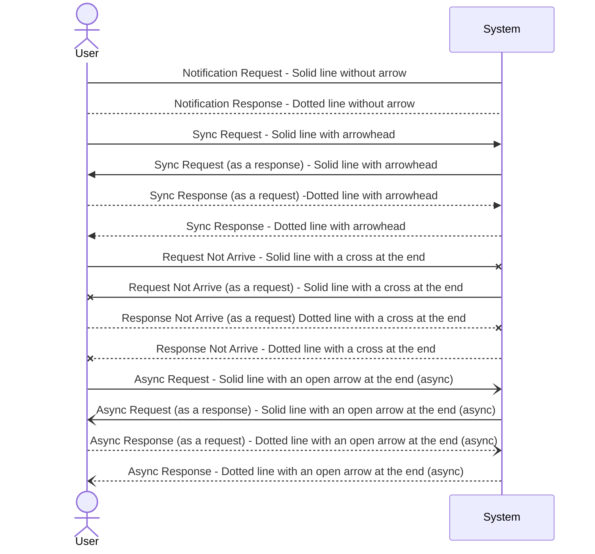

# Sequence Diagram

```mermaid
sequenceDiagram
	actor User
	participant System
	User->System: Notification Request - Solid line without arrow
	User-->System: Notification Response - Dotted line without arrow
	User->>System: Sync Request - Solid line with arrowhead
	System->>User: Sync Request (as a response) - Solid line with arrowhead
	User-->>System: Sync Response (as a request) -Dotted line with arrowhead
	System-->>User: Sync Response - Dotted line with arrowhead
	User-xSystem: Request Not Arrive - Solid line with a cross at the end
	System-xUser: Request Not Arrive (as a request) - Solid line with a cross at the end
	User--xSystem: Response Not Arrive (as a request) Dotted line with a cross at the end
	System--xUser: Response Not Arrive - Dotted line with a cross at the end
	User-)System: Async Request - Solid line with an open arrow at the end (async)
	System-)User: Async Request (as a response) - Solid line with an open arrow at the end (async)
	User--)System: Async Response (as a request) - Dotted line with an open arrow at the end (async)
	System--)User: Async Response - Dotted line with an open arrow at the end (async)
```
