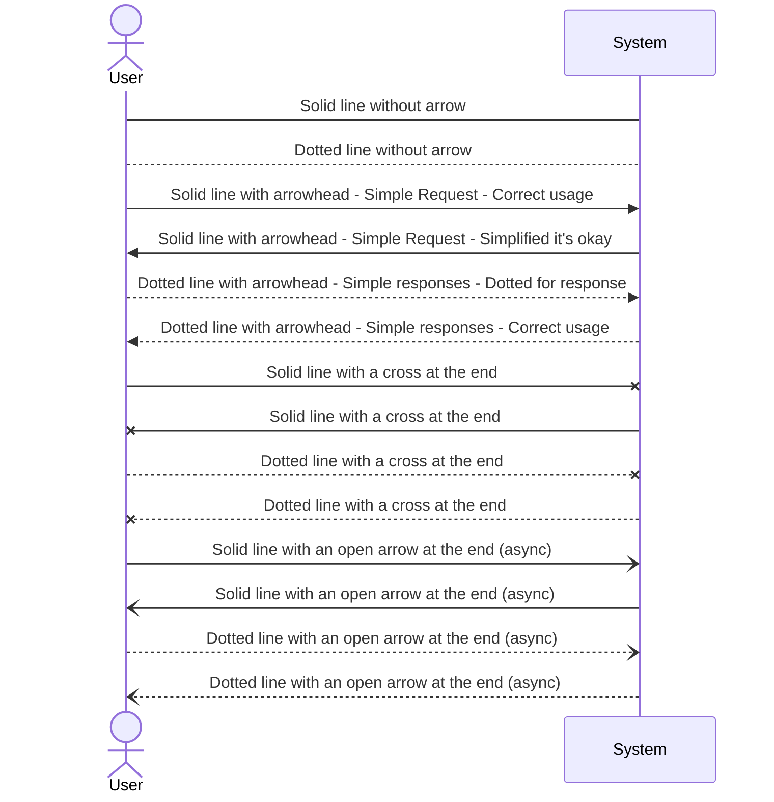

# Sequence Diagram

```mermaid
sequenceDiagram
	actor User
	participant System
	User->System: Solid line without arrow
	User-->System: Dotted line without arrow
	User->>System: Solid line with arrowhead - Simple Request - Correct usage
	System->>User: Solid line with arrowhead - Simple Request - Simplified it's okay
	User-->>System: Dotted line with arrowhead - Simple responses - Dotted for response
	System-->>User: Dotted line with arrowhead - Simple responses - Correct usage
	User-xSystem: Solid line with a cross at the end
	System-xUser: Solid line with a cross at the end
	User--xSystem: Dotted line with a cross at the end
	System--xUser: Dotted line with a cross at the end
	User-)System: Solid line with an open arrow at the end (async)
	System-)User: Solid line with an open arrow at the end (async)
	User--)System: Dotted line with an open arrow at the end (async)
	System--)User: Dotted line with an open arrow at the end (async)
```
