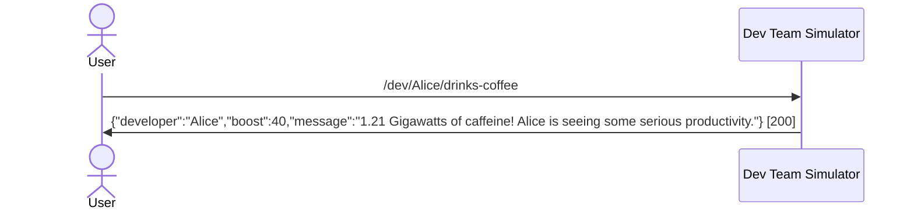
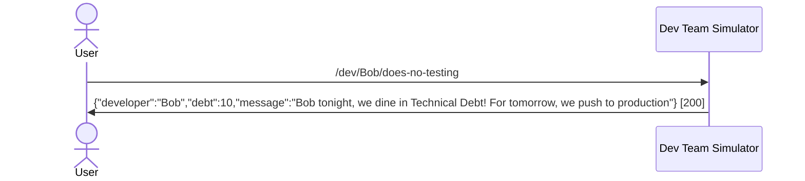

### Test Suite: Dev team simulator test

**Notes:**
- Dev Team Simulator: Verify developer actions endpoints – the world's most advanced team simulator... that only masters drinking coffee and accumulating tech debt, with predetermined biased outputs ☕🚫

**Summary:** Tests: 2, Passed: 2, Failed: 0, Skipped: 0, Aborted: 0

#### Scenario: Given developer is "Alice" [PASSED]
**Steps:**
Given developer is "Alice"
When developer drinks coffee
Then developer gets performance boost

**Interactions:**

#### Scenario: Given developer is "Bob" [PASSED]
**Steps:**
Given developer is "Bob"
When developer does no testing
Then developer gets tech dept

**Interactions:**

